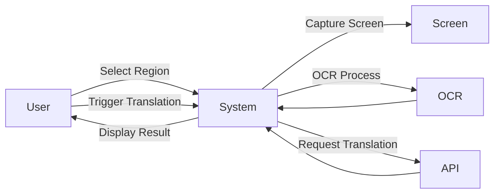
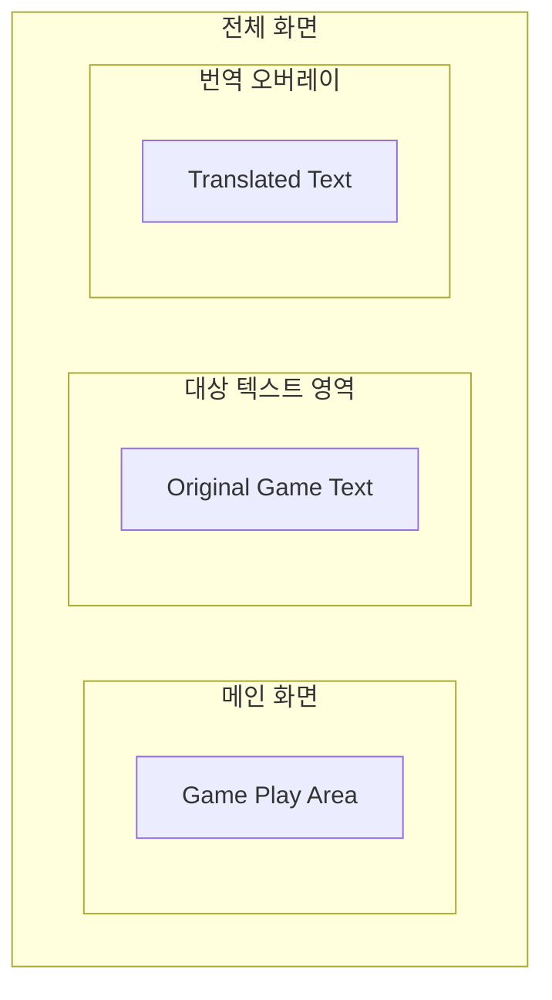

# 2. Analysis

## Project Title
Screen Translator

## Student Info
- Student No: [22411982]
- Name: [박찬승]
- E-mail: [seung050204@gmail.com]
- GitHub: [https://github.com/Pcs0204/ScreenTranslator]

---

## Revision History

| Date | Version | Description | Author |
|------|--------|------------|--------|
| 2026-04-15 | 0.1 | Initial draft | 박찬승 |
| 2026-04-15 | 0.2 | First change | 박찬승 |

---

## Contents
1. Introduction  
2. Use Case Analysis  
3. Domain Analysis  
4. User Interface Prototype  
5. Glossary  
6. References  

---

## 1. Introduction

본 문서는 "Screen Translator" 시스템의 분석 단계 내용을 정리한 것이다.

본 시스템은 사용자가 지정한 화면 영역에서 텍스트를 추출(OCR)하고, 이를 번역하여 화면에 오버레이 형태로 출력하는 기능을 제공한다.

### 주요 특징
- **유용성**: 게임 텍스트 번역 지원
- **실시간성**: 단축키 기반 빠른 번역 수행
- **확장성**: 자동 번역, 다양한 언어 지원 기능 추가 가능
- **사용 편의성**: 간단한 UI 및 최소한의 사용자 입력

---

## 2. Use Case Analysis

### Use Case Diagram

### Use Case Description

1) Select Region

| 항목 | 내용 |
|-----|-----|
| Actor | User |
| Description | 사용자가 번역할 화면 영역을 선택한다 |
| Pre-condition | 프로그램 실행 상태 |
| Post-condition | 선택된 영역 저장 |

2) Trigger Translation

| 항목 | 내용 |
|-----|-----|
| Actor	| User |
| Description | 단축키를 통해 번역을 실행한다 |
| Pre-condition | 영역이 지정되어 있어야 함 |
| Post-condition | 번역 프로세스 시작 |

3) Display Result

| 항목	| 내용 |
|-----|-----|
| Actor	| System |
| Description | 번역 결과를 화면에 오버레이로 출력 |
| Pre-condition | 번역 완료 |
| Post-condition | 사용자에게 결과 표시 |

---

## 3. Domain Analysis

### 주요 클래스 정의

| Class | Description |
|-----|-----|
| ScreenCapture | 화면의 특정 영역을 캡처하는 클래스 |
| OCRProcessor | 이미지에서 텍스트를 추출하는 클래스 |
| Translator | 텍스트를 번역하는 클래스 |
| OverlayUI | 번역 결과를 화면에 표시하는 클래스 |
| HotkeyManager | 단축키 입력을 처리하는 클래스 |
| MainController | 전체 흐름을 제어하는 클래스 |

### 클래스 관계
MainController는 전체 프로세스를 관리한다
ScreenCapture는 화면 이미지를 제공한다
OCRProcessor는 이미지에서 텍스트를 추출한다
Translator는 텍스트를 번역한다
OverlayUI는 결과를 출력한다
HotkeyManager는 사용자 입력을 감지한다

---

## 4. User Interface Prototype

### 기본 UI 구성

-영역 선택 모드
단축키 입력 시 영역 지정 상태 활성화
마우스 드래그로 영역 지정

-번역 실행
단축키 입력 시 번역 수행

-결과 출력
번역 결과를 화면 위에 오버레이로 표시
기존 화면을 가리지 않도록 반투명 처리

-사용자 흐름
프로그램 실행
단축키로 영역 지정
번역 단축키 입력
결과 확인

---

## 5. Glossary

---

## 6. References
