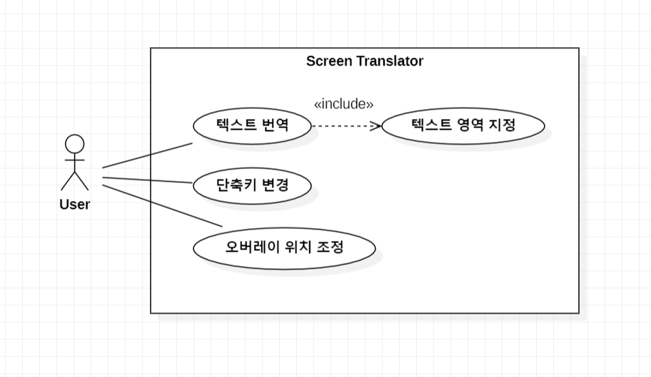
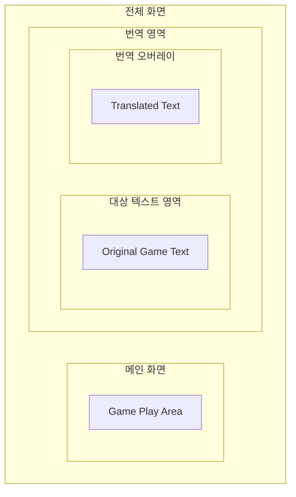

# 2. Analysis

## Project Title
Screen Translator

## Student Info
- Student No: [22411982]
- Name: [박찬승]
- E-mail: [seung050204@gmail.com]
- GitHub: [https://github.com/Pcs0204/ScreenTranslator]

---

## Revision History

| Date | Version | Description | Author |
|------|--------|------------|--------|
| 2026-04-15 | 0.1 | Initial draft | 박찬승 |
| 2026-04-15 | 0.2 | First change | 박찬승 |

---

## Contents
1. Introduction  
2. Use Case Analysis  
3. Domain Analysis  
4. User Interface Prototype  
5. Glossary  
6. References  

---

## 1. Introduction

본 문서는 "Screen Translator" 시스템의 분석 단계 내용을 정리한 것이다.

본 시스템은 사용자가 지정한 화면 영역에서 텍스트를 추출(OCR)하고, 이를 번역하여 화면에 오버레이 형태로 출력하는 기능을 제공한다.

### 주요 특징
- **유용성**: 게임 텍스트 번역 지원
- **실시간성**: 단축키 기반 빠른 번역 수행
- **확장성**: 자동 번역, 다양한 언어 지원 기능 추가 가능
- **사용 편의성**: 간단한 UI 및 최소한의 사용자 입력

---

## 2. Use Case Analysis

### Use Case Diagram

### Use Case Description

## Use Case #1 : 텍스트 영역 지정

# GENERAL CHARACTERISTICS

| Item | Description |
|------|-------------|
| Summary | 사용자가 번역할 화면의 텍스트 영역을 지정하는 기능 |
| Scope | Screen Translator System |
| Level | User level |
| Author | 박찬승 |
| Last Update | 2026-05-07 |
| Status | Analysis |
| Primary Actor | User |
| Preconditions | 프로그램이 실행 중이어야 한다. |
| Trigger | 사용자가 영역 지정 단축키를 입력했을 때 |
| Success Post Condition | 시스템이 선택된 화면 영역을 저장한다. |
| Failed Post Condition | 영역 선택에 실패하여 번역 기능을 수행할 수 없다. |

# MAIN SUCCESS SCENARIO

| Step | Action |
|------|--------|
| 1 | 이 Use case는 사용자가 영역 지정 단축키를 입력할 때 시작된다. |
| 2 | 시스템은 화면을 반투명 상태로 변경한다. |
| 3 | 사용자는 마우스로 번역할 텍스트 영역을 드래그하여 선택한다. |
| 4 | 시스템은 선택된 영역의 좌표를 저장한다. |
| 5 | 이 Use case는 영역 저장이 완료되면 끝난다. |

# EXTENSION SCENARIO

| Step | Branching Action |
|------|------------------|
| 3 | 3a. 사용자가 영역 선택을 취소할 수 있다. |
| 3a1 | 시스템은 기존 영역 설정을 유지한다. |
| 3a2 | 메인 화면으로 돌아간다. |

# RELATED INFORMATION

| Item | Description |
|------|-------------|
| Performance | < 1 second |
| Frequency | 사용자당 하루 평균 3~5회 |
| Concurrency | No Limits |

---

## Use Case #2 : 텍스트 번역

# GENERAL CHARACTERISTICS

| Item | Description |
|------|-------------|
| Summary | 지정된 화면 영역의 텍스트를 추출하고 번역하는 기능 |
| Scope | Screen Translator System |
| Level | User level |
| Author | 박찬승 |
| Last Update | 2026-05-07 |
| Status | Analysis |
| Primary Actor | User |
| Preconditions | 텍스트 영역이 지정되어 있어야 한다. |
| Trigger | 사용자가 번역 실행 단축키를 입력했을 때 |
| Success Post Condition | 번역 결과가 화면에 출력된다. |
| Failed Post Condition | 번역 실패 메시지가 출력된다. |

# MAIN SUCCESS SCENARIO

| Step | Action |
|------|--------|
| 1 | 이 Use case는 사용자가 번역 실행 단축키를 입력할 때 시작된다. |
| 2 | 시스템은 저장된 영역의 화면을 캡처한다. |
| 3 | 시스템은 OCR 기능을 사용하여 텍스트를 추출한다. |
| 4 | 시스템은 추출된 텍스트를 번역 API로 전달한다. |
| 5 | 시스템은 번역 결과를 화면 오른쪽 오버레이 영역에 표시한다. |
| 6 | 이 Use case는 번역 결과 출력 후 종료된다. |

# EXTENSION SCENARIO

| Step | Branching Action |
|------|------------------|
| 3 | 3a. OCR이 텍스트를 인식하지 못할 수 있다. |
| 3a1 | 시스템은 텍스트 인식 실패 메시지를 출력한다. |
| 4 | 4a. 번역 API 연결에 실패할 수 있다. |
| 4a1 | 시스템은 번역 실패 메시지를 출력한다. |

# RELATED INFORMATION

| Item | Description |
|------|-------------|
| Performance | < 2 seconds |
| Frequency | 사용자당 하루 평균 20회 이상 |
| Concurrency | No Limits |

---

## Use Case #3 : 단축키 변경

# GENERAL CHARACTERISTICS

| Item | Description |
|------|-------------|
| Summary | 사용자가 기능 실행 단축키를 변경하는 기능 |
| Scope | Screen Translator System |
| Level | User level |
| Author | 박찬승 |
| Last Update | 2026-05-07 |
| Status | Analysis |
| Primary Actor | User |
| Preconditions | 프로그램이 실행 중이어야 한다. |
| Trigger | 사용자가 설정 메뉴에서 단축키 변경을 선택했을 때 |
| Success Post Condition | 새로운 단축키가 저장된다. |
| Failed Post Condition | 단축키 변경이 적용되지 않는다. |

# MAIN SUCCESS SCENARIO

| Step | Action |
|------|--------|
| 1 | 이 Use case는 사용자가 단축키 설정 메뉴를 열 때 시작된다. |
| 2 | 사용자는 변경할 기능을 선택한다. |
| 3 | 사용자는 새로운 키 입력을 등록한다. |
| 4 | 시스템은 입력된 단축키의 중복 여부를 확인한다. |
| 5 | 시스템은 새로운 단축키를 저장한다. |
| 6 | 이 Use case는 설정 저장 후 종료된다. |

# EXTENSION SCENARIO

| Step | Branching Action |
|------|------------------|
| 4 | 4a. 이미 사용 중인 단축키일 수 있다. |
| 4a1 | 시스템은 중복 경고 메시지를 출력한다. |
| 4a2 | 사용자는 다른 단축키를 입력한다. |

# RELATED INFORMATION

| Item | Description |
|------|-------------|
| Performance | < 1 second |
| Frequency | 사용자당 하루 평균 1회 이하 |
| Concurrency | No Limits |

---

## Use Case #4 : 오버레이 위치 조정

# GENERAL CHARACTERISTICS

| Item | Description |
|------|-------------|
| Summary | 사용자가 번역 결과 오버레이의 위치를 변경하는 기능 |
| Scope | Screen Translator System |
| Level | User level |
| Author | 박찬승 |
| Last Update | 2026-05-07 |
| Status | Analysis |
| Primary Actor | User |
| Preconditions | 번역 오버레이가 활성화되어 있어야 한다. |
| Trigger | 사용자가 오버레이 위치 변경 기능을 실행했을 때 |
| Success Post Condition | 새로운 오버레이 위치가 저장된다. |
| Failed Post Condition | 오버레이 위치가 변경되지 않는다. |

# MAIN SUCCESS SCENARIO

| Step | Action |
|------|--------|
| 1 | 이 Use case는 사용자가 오버레이 이동 모드를 실행할 때 시작된다. |
| 2 | 시스템은 오버레이 창 이동 기능을 활성화한다. |
| 3 | 사용자는 마우스로 오버레이 창을 원하는 위치로 이동한다. |
| 4 | 시스템은 새로운 위치를 저장한다. |
| 5 | 이 Use case는 위치 저장 후 종료된다. |

# EXTENSION SCENARIO

| Step | Branching Action |
|------|------------------|
| 3 | 3a. 사용자가 이동을 취소할 수 있다. |
| 3a1 | 시스템은 기존 위치를 유지한다. |

# RELATED INFORMATION

| Item | Description |
|------|-------------|
| Performance | < 1 second |
| Frequency | 사용자당 하루 평균 1~2회 |
| Concurrency | No Limits |
---

## 3. Domain Analysis

### 주요 클래스 정의

| Class | Description |
|-----|-----|
| ScreenCapture | 화면의 특정 영역을 캡처하는 클래스 |
| OCRProcessor | 이미지에서 텍스트를 추출하는 클래스 |
| Translator | 텍스트를 번역하는 클래스 |
| OverlayUI | 번역 결과를 화면에 표시하는 클래스 |
| HotkeyManager | 단축키 입력을 처리하는 클래스 |
| MainController | 전체 흐름을 제어하는 클래스 |

### 클래스 관계
MainController는 전체 프로세스를 관리한다
ScreenCapture는 화면 이미지를 제공한다
OCRProcessor는 이미지에서 텍스트를 추출한다
Translator는 텍스트를 번역한다
OverlayUI는 결과를 출력한다
HotkeyManager는 사용자 입력을 감지한다

---

## 4. User Interface Prototype

### 기본 UI 구성

-영역 선택 모드
단축키 입력 시 영역 지정 상태 활성화
마우스 드래그로 영역 지정

-번역 실행
단축키 입력 시 번역 수행

-결과 출력
번역 결과를 화면 위에 오버레이로 표시
기존 화면을 가리지 않도록 반투명 처리

-사용자 흐름
프로그램 실행
단축키로 영역 지정
번역 단축키 입력
결과 확인

---

## 5. Glossary

---

## 6. References
