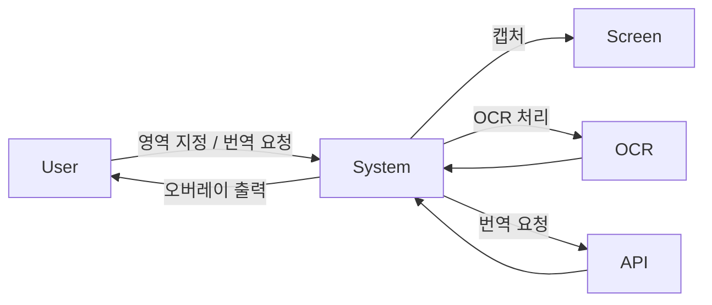

# 1. Conceptualization

## Project Title
Real-time Screen Translator

## Student Info
- Student No: [22411982]
- Name: [박찬승]
- E-mail: [seung050204@gmail.com]
- GitHub: [https://github.com/Pcs0204/ScreenTranslator]

---

## Revision History

| Date | Version | Description | Author |
|------|--------|------------|--------|
| 2026-03-22 | 0.1 | Initial draft | 박찬승 |

---

## Contents
1. Business Purpose  
2. System Context Diagram  
3. Use Case List  
4. Concept of Operation  
5. Problem Statement  
6. Glossary  
7. References  

---

## 1. Business Purpose

본 프로젝트는 실시간 번역이 필요한 상황(미번역된 게임플레이 등)을 해결하기 위해 개발된다.

최근 게임시장에는 전세계에서 수많은 종류의 게임들이 새롭게 출시되고있다. 그러나 이런 게임들 중엔 한글 번역이 포함되지 않은 경우가 종종 있다.

본 시스템은 사용자가 지정한 화면 영역을 기반으로 텍스트를 추출(OCR)하고, 이를 번역하여 화면에 오버레이 형태로 출력함으로써 실시간 정보전달을 지원하는 것을 목표로 한다.

### Goal
- 게임 화면 속 주요 텍스트를 빠르게 번역
- 사용자 개입 최소화 (단축키 기반)
- 직관적인 UI 제공

### Target market
- 미번역된 게임을 하는 플레이어
- 실시간 화면 번역이 필요한 사용자

---

## 2. System Context Diagram

### 관계 설명
- 사용자는 단축키를 통해 시스템을 제어한다.
- 시스템은 게임 화면의 특정 영역을 캡처한다.
- 캡처된 이미지는 OCR을 통해 텍스트로 변환된다.
- 텍스트는 번역 API를 통해 번역된다.
- 번역 결과는 사용자 화면에 오버레이로 표시된다.

---

## 3. Use Case List

| Use Case | Actor | Description |
|----------|------|------------|
| 영역 지정 | User | 사용자가 번역할 화면 영역을 지정한다 |
| 번역 실행 | User | 단축키를 통해 번역을 수행한다 |
| 결과 출력 | System | 번역된 텍스트를 화면에 표시한다 |

---

## 4. Concept of Operation

### 1) 영역 지정

| 항목 | 내용 |
|------|------|
| Purpose | 번역할 화면 영역 설정 |
| Approach | 사용자가 단축키 입력 후 드래그로 영역 지정 |
| Dynamics | 초기 설정 시 1회 수행 |
| Goals | 정확한 OCR 대상 영역 확보 |

---

### 2) 번역 실행

| 항목 | 내용 |
|------|------|
| Purpose | 채팅 텍스트 번역 |
| Approach | 지정된 영역 캡처 → OCR → 번역 |
| Dynamics | 단축키 입력 시 수행 |
| Goals | 빠르고 정확한 번역 결과 제공 |

---

### 3) 결과 출력

| 항목 | 내용 |
|------|------|
| Purpose | 번역 결과 시각화 |
| Approach | 화면 위 오버레이 형태로 출력 |
| Dynamics | 번역 완료 후 즉시 표시 |
| Goals | 오버레이 위치 변경 기능 |

---

## 5. Problem Statement

### 기술적 문제
- OCR 정확도 문제 (작은 글씨, 복잡한 배경)
- 실시간 처리 성능 문제
- 번역 API 호출 지연

### 해결 방향
- 이미지 전처리를 통한 OCR 정확도 향상
- 캡처 영역 최소화로 속도 개선
- 단축키 기반 반실시간 방식 채택

---

### Non-Functional Requirements (NFRs)

- 성능: 1~2초 내 번역 결과 출력
- 사용성: 단축키 기반 간단한 조작
- 안정성: 오류 발생 시 프로그램 지속 실행
- 확장성: 향후 자동 번역 기능 추가 가능

---

## 6. Glossary

| 용어 | 설명 |
|------|------|
| OCR | Optical Character Recognition/광학 문자 인식: 이미지에서 텍스트를 추출하는 기술 |
| Overlay | 화면 위에 겹쳐 표시되는 UI |
| API | 외부 서비스와 통신하기 위한 인터페이스 |
| Capture | 화면의 특정 영역을 이미지로 저장하는 과정 |

---

## 7. References

- :[pytesseract GitHub Repository](https://github.com/madmaze/pytesseract)[oaicite:0]{index=0}
